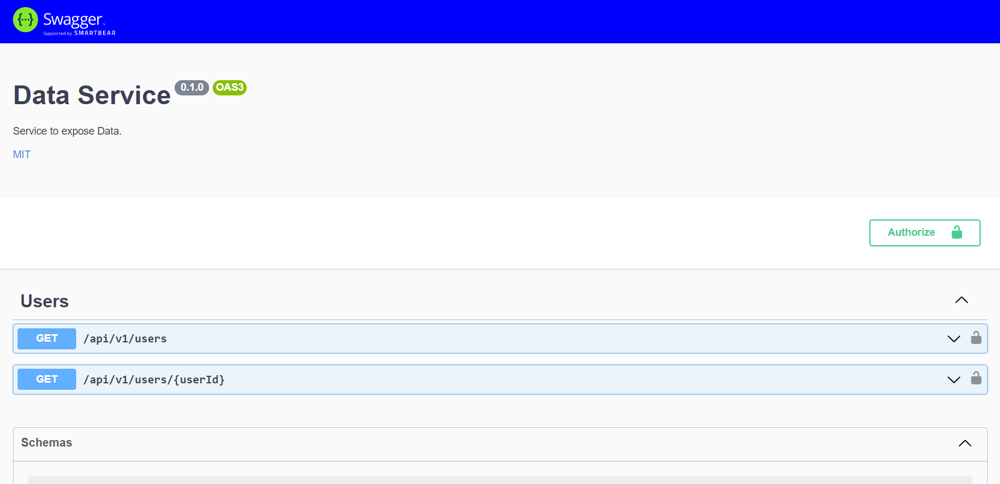

import Callout from 'nextra-theme-docs/callout'

# Interfaz de Swagger
<Callout type="warning" emoji="⚠">
Esta función no está disponible cuando se utiliza OpenAPI 3.1
</Callout>

## Resumen
La interfaz de Swagger está activa por defecto en la configuración. Puedes desactivarla o configurarla para que se muestre en una ruta diferente (por defecto es `/docs`).

Esta integración de la interfaz swagger consiste en una clase middleware que envuelve el paquete [swagger-ui-express](https://www.npmjs.com/package/swagger-ui-express). De esta manera, OAS Tools es capaz de integrarlo dentro de su cadena de middleware y extender su configuración añadiendo nuevas opciones, como la posibilidad de ocultar los endpoints de la documentación de swagger.


## Configuration
Thanks to the OAS Tools integration of the SwaggerUI, many configuration options are available across the project. Some of the posibilities are listed below.

### Ocultar endpoints
OAS Tools ofrece la posibilidad de ocultar determinados endpoints de la interfaz swagger, dependiendo de si las anotaciones experimentales JSDoc están activadas o no:

#### A través del documento OpenAPI
Para ocultar una o varias operaciones de la documentación de Swagger, es necesario añadir `x-swagger-ui: false` en el nivel de operación del documento OpenAPI.

```yaml
...
  get:  
    x-swagger-ui: false
    description: Some endpoint's operation    
    responses:
      ...

```

#### Utilizando anotaciones _(Experimental)_
Cuando las anotaciones experimentales de JSDoc están habilitadas, las operaciones se pueden ocultar simplemente añadiendo la anotación `@oastools {swaggerUI} false` encima de la operación del controlador que se quiere ocultar.

```js
/**
 * @oastools {method} POST
 * @oastools {swaggerUI} false */
module.exports.createUser = function createUser(req, res) {
  varUserController.createUser(req, res);
};

```

### CustomCSS
El CSS personalizado es una característica ya incluida en el paquete express-swagger-ui envuelto dentro del middleware swagger de OAS Tools. Puedes configurar el CSS personalizado desde la configuración global del servidor, en `middleware.swagger.ui.customCSS`:

```json
// .oastoolsrc

{
  "middleware": {
    "swagger": {
      "ui" : {
        "customCss": ".swagger-ui .topbar { background-color: blue }"
      }
    }
  }
}
```
El ejemplo anterior daría como resultado una interfaz swagger con un topnav azul:



### Más opciones
Más opciones se heredan del paquete npm swagger-ui-express. Por favor, visite [su documentación](https://github.com/scottie1984/swagger-ui-express#custom-css-styles) para conocer todas las opciones de configuración posibles.
